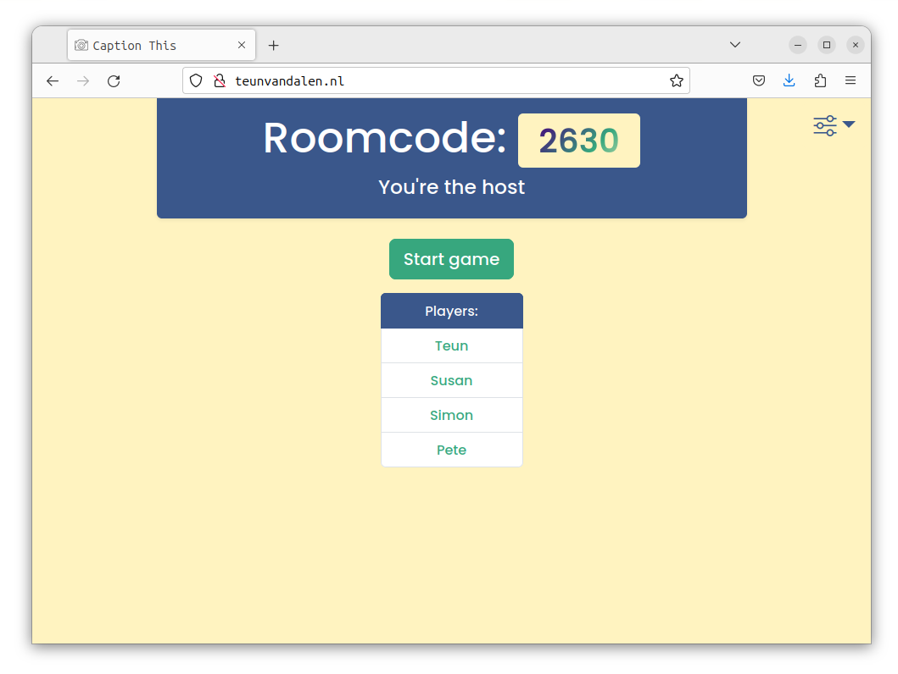
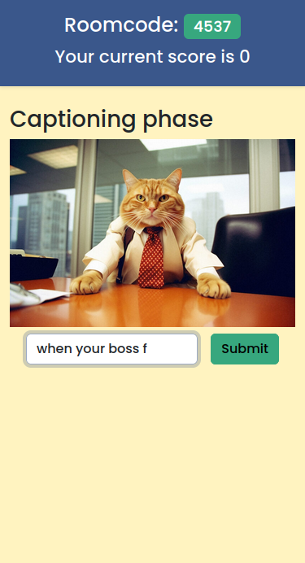

## Caption This
'Caption This' is a web-based game where players get to caption photos shared by others in real-time, inspired by the Jackbox TV party-games. Each round,players come up with the funniest, quirkiest, or most relevant captions. All players then vote on the caption the like the most. The funniest caption wins the round, and the game continues, ensuring endless laughter and enjoyment. 

## Getting started. 
Go to http://teunvandalen.nl to play the game. No installing needed. One client creates a room, that device will act as the host/presentation view. Players can join the room with the room code via their mobile phone. Both of these connect with the socket.io server in the server folder.

## Optional: Install instructions.
You can also run the server yourself on your local device, see the specific folders for install instructions. Beaware that the backend requires mongoDB to store some game-stats. Therefore, make sure that the url in server/database/setup.ts points to a running mongoDB server. Just starting a basic mongoDB server with 'sudo systemctl start mongod' should be enough. 
You can run the vite development server for the front-end locally as well. 

## Back-end technologies
- Typescript
- Socket.io
- MongoDB

## Front-end technologies
- Typescript
- Vite (Development server)
- Socket.io - client
- React
- Tailwind

## Architecture

